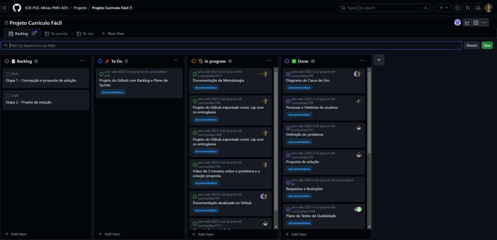

# Metodologia

A metodologia contempla as ferramentas e utilizadas pela equipe para o desenvolvimento e manutenção do projeto.

Para o controle do projeto utilizaremos o github para versionamento seguindo as definiçoes listadas abaixo. 

Utilizaremos o github projects para gerenciamento de sprints e backlog do produto. A fim de uma melhor gestão de projeto utilizaremos o Whatzap para informações comunicações diarias e o discord para reuniões.

O projeto de interface foi criado no MarvelApp em conjunto com o figma para maior facilidade no desenvolvimento e prototipação do design.

## Controle de Versão

A ferramenta de controle de versão adotada no projeto foi o
[Git](https://git-scm.com/), sendo que o [Github](https://github.com)
foi utilizado para hospedagem do repositório.

O projeto segue a seguinte convenção para o nome de branches:

- `main`: versão estável já testada do software
- `dev`: versão de desenvolvimento do software

Quanto à gerência de issues, o projeto adota a seguinte convenção para
etiquetas:

- `documentation`: melhorias ou acréscimos à documentação
- `bug`: uma funcionalidade encontra-se com problemas
- `enhancement`: uma funcionalidade precisa ser melhorada
- `feature`: uma nova funcionalidade precisa ser introduzida

A branch principal é a main, onde estara a versão estável e testada da aplicação, a brch dev contemplará a versão do sisteman em desenvolvimento bem como os testes.

## Gerenciamento de Projeto

### Divisão de Papéis
A equipe utiliza metodologias ágeis, tendo escolhido o Scrum como base para definição do processo de desenvolvimento.

Scrum Master: Philippe Ribeiro Mesquita

Product Owner: Mahavishnu Jneesh Afonso de Almeida 

Equipe de Desenvolvimento:

* Philippe Ribeiro Mesquita
* Allan Cesar Amaral Gomes 
* João Gabriel Pereira da Silva 
* Rafael Santana de Oliveira 
* Mahavishnu Jneesh Afonso de Almeida

Equipe de Design:
* Philippe Ribeiro Mesquita
* Mahavishnu Jneesh Afonso de Almeida

Para organização e distribuição das tarefas do projeto, a equipe está utilizando o Github Projects.
  
  

  
### Processo

O processo de desenvolvimento consiste em: Reunião de planejamento na segunda, acompanhamento pelo whatzap com trocas de mensagens em formato de dayli e retrospectiva. A Cerimônia de planejamento e realizada no início da sprint a fim de definir as tarefas a serem executadas. Reunião de revisão de acompanhamento do que está sendo feito nas sextas pelo discord.

### Ferramentas

As ferramentas empregadas no projeto são:

- Editor de código - Visual Studio Code
- Ferramentas de comunicação - Whatzap/Discord
- Ferramentas de desenho de tela - MarvelAPP/Figma

O editor de código foi escolhido porque ele possui uma integração com o sistema de versão. As ferramentas de comunicação utilizadas possuem integração semelhante e por isso foram selecionadas. Por fim, para criar diagramas utilizamos essa ferramenta por melhor captar as necessidades da nossa solução.

Whatzap foi selecionado como ferramenta de comunicação pois todos os integrantes do projeto já usavam antes do seu inicio. Discord foi selecionado pela praticidade de compartilhamento de
tela e comunicação com os integrantes.

MarvelAPP foi selecionado para a produção dos wireframes pela sua facilidade em permitir de forma simples a prototipação do projeto.

Figma foi selecionado como ferrementa para criação do design padrão do site por possuir recursos mais avançados em relação ao design.