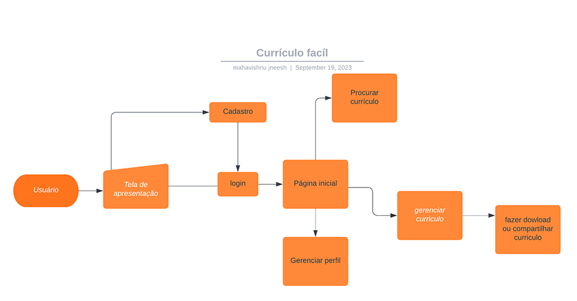
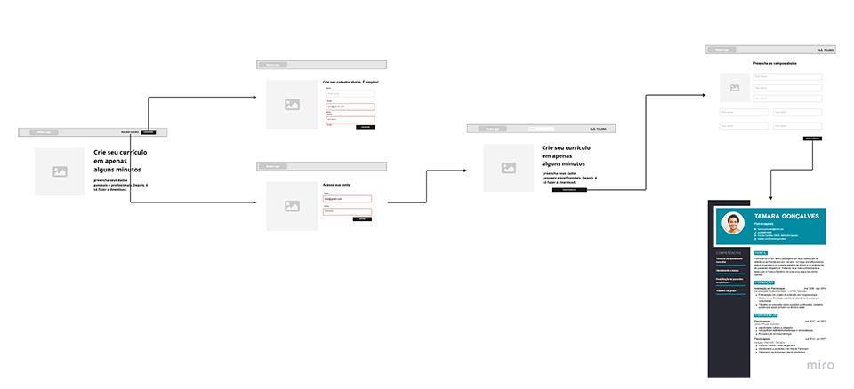
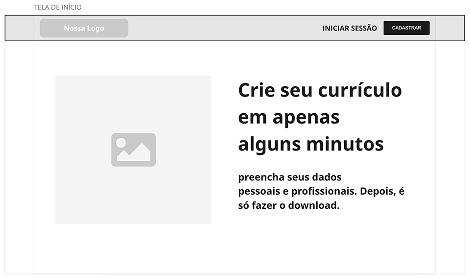
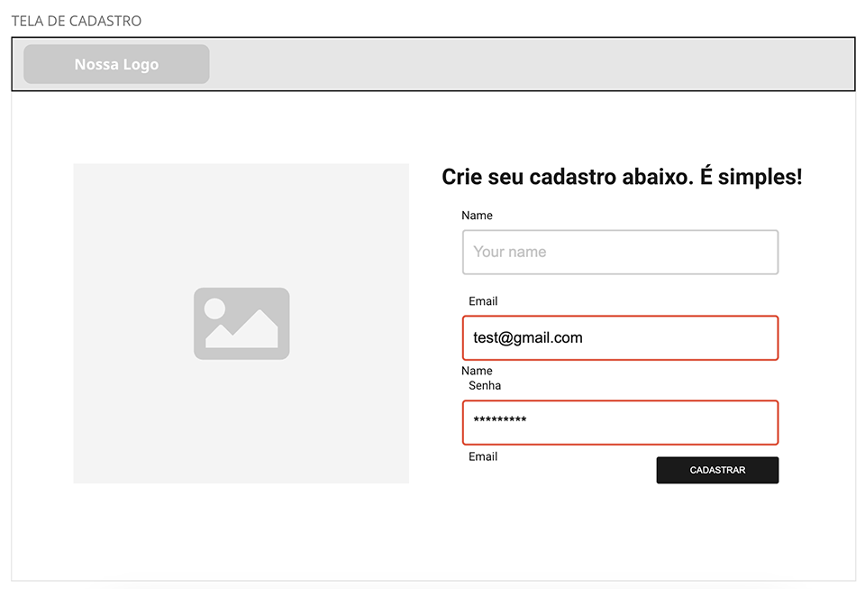
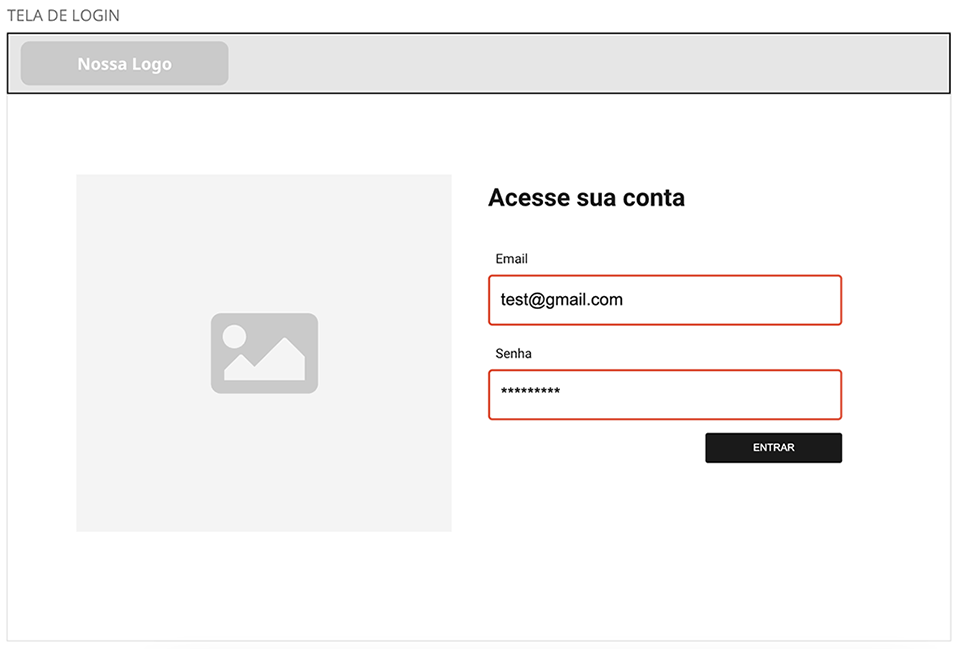
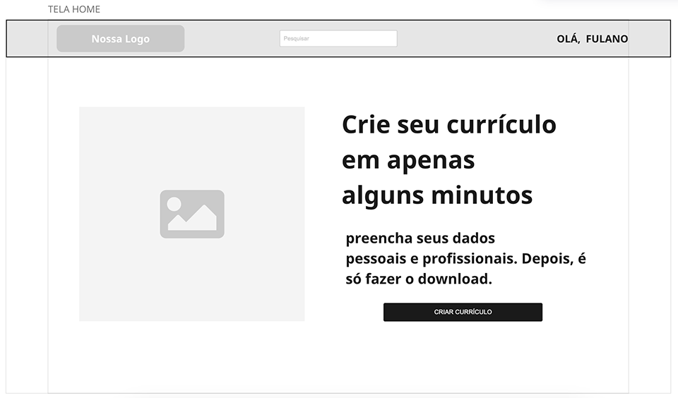
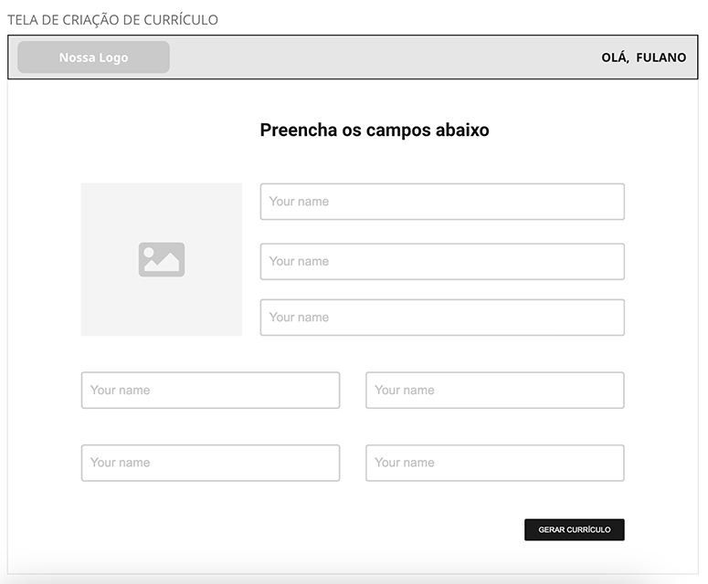

# Projeto de Interface

Nos topicos a Seguir abordamos os exemplos e prototipos(wireframes) produzidos para  a visualização geral da interação do usuário com as telas do sistema.

## Diagrama de Fluxo

O diagrama apresenta o estudo do fluxo de interação do usuário com o sistema interativo sem a necesseidade de um design preio. A seguir o Diagrama de fluxo da aplicação comtemplando todo o processo de utilização pelo usuario.

## Wireframes

### Wireframe do fluxo total do projeto

Wiraframes são protótipos usados em design de interface para sugerir a estrutura de um site web e seu relacionamentos entre suas páginas.
Um wireframe web é uma ilustração semelhante do layout de elementos fundamentais na interface.

### Tela Inicial da aplicação

### Tela de Cadastro

### Tela de Login

### Tela Home

### Tela de Cadastro de curriculo

