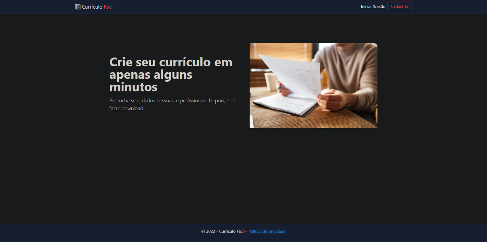
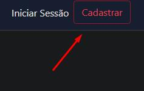

# Registro de Testes de Software

Pré-requisitos: <a href="3-Projeto de Interface.md"> Projeto de Interface</a>, <a href="8-Plano de Testes de Software.md"> Plano de Testes de Software</a>

Para cada caso de teste definido no Plano de Testes de Software segue o registro de caso de teste de Software 

## AvaliaçãoRegistro de testes de Software
Registro de testes de Software

·        CT-01 Caso de teste 1: Acesso de usuário 

Requisito Referente: (RF-01) O usuário deve possuir acesso de maneira simplificada a plataforma, ao utilizar seu e-mail e senha como chaves de acesso a mesma.  

Objetivo do teste: Checar se o sistema concretiza o acesso ao sistema de maneira correta e segura. 

Passos: 

 1) Inserir informações como e-mail e senha na tela de login. Caso não possua conta, haverá um botão de cadastro. 

Critérios de êxito: a plataforma salvar os dados do usuário e o redirecionar para a tela principal da plataforma. 

2) Após o login o usuário é redirecionado para a tela de adicionar informações no perfil, após a realização dessa etapa ele será redirecionado para a tela principal da plataforma. 

Critérios de êxito: a plataforma salvar os dados referentes ao perfil do usuário. 

Etapas do teste:

Etapa 1 – Abertura do site. Assim que entrar no site, irá se deparar com esta tela.

Etapa 2 – Selecionar opção de cadastro. Após a abertura do site, selecione a opção no canto superior direito da tela no qual se diz cadastrar.

Etapa 3 – Preencher suas informações pessoais necessárias para o cadastro de conta. Dependendo da intenção do usuário ao entrar na plataforma, ele deverá selecionar a opção Empresa Ou usuário.

Etapa 4 – Após as informações preenchidas, o usuário ao confirmar cadastro deve ser redirecionado para a tela inicial pós criação de conta.

Etapa 5 (Final) – Para que o teste seja devidamente efetivado com sucesso, o software deve mostrar o nome do usuário no canto superior direito da tela.

·        Caso de teste 2: Personalização de currículo 

Requisito Referente: (RF-02/RF-03/RF-10) O usuário deve ter a possibilidade de customização de seu currículo, adicionando e mudando informações existentes, além do uso de estilos inseridos previamente no desenvolvimento da página para tornar os currículos mais agradáveis e únicos. 

Objetivo do teste: Analisar a facilidade na troca de estilos pré-programados e verificar intuitividade no uso da ferramenta de troca de visuais. 

Passos: 

 1) Ao entrar na tela inicial da plataforma, o usuário recebe uma solicitação de criação de um currículo após concluir o seu perfil. 

Critérios de êxito: a plataforma salvar o seu currículo. 

2) O usuário terá uma opção na tela de alteração do currículo. 

Critérios de êxito 1: Ser direcionado para uma tela que permite o usuário utilizar inúmeras ferramentas intuitivas para auxiliar e estilizar o currículo ao critério do mesmo. 

Critérios de êxito 2: Usuário ver as mudanças em seu currículo após editar suas escolhas. 

Etapas do teste:

Etapa 1 – Seguimento para criação de currículo. Após direcionamento para a página inicial, o usuário deve clicar na opção de criar currículo.

Etapa 2 – O usuário é redirecionado ao criador de currículo, onde o mesmo deve preencher suas informações precisas para serem geradas e finalmente alocadas ao currículo final.

Etapa 3 – Após finalizar o currículo, o usuário é levado a aba de meus currículos, onde pode ver detalhes do currículo criado, editar, deletar e criar novos currículos.

Etapa 3.2 – Caso o usuário clique em detalhes, será redirecionado as informações do currículo prontas.

 

Etapa 4(Final) – Após clicar em detalhes, a funcionalidade se apresentará pronta e efetiva ao trazer todas as informações previamente ditas durante o cadastro do curríclo.

·        Caso de teste 3: Filtragem e buscas 

Requisitos Referentes: (RF-07/RF-09) A plataforma precisa fornecer uma fácil opção de busca por currículos e juntamente uma ferramenta de filtragem por capacidades e especializações dos candidatos a busca de vagas. 

Objetivo do teste: Verificar intuitividade e efetividade do sistema em busca e filtragem de currículos. 

Passos: 

 1) Após a criação do currículo, uma barra de busca será exibida no cabeçalho da página indicando acesso liberado para buscar currículos. 

2) Ao clicar na lupa, filtros serão exibidos ao lado liberando precisão na busca 

3) Usuário confirma os filtros e efetua a busca na lupa. 

Critérios de êxito: Usuários terão acesso a uma página específica com currículos previamente filtrados para busca. 

Etapas do teste:

Etapa 1 – Criação de um perfil com funcionalidades diferentes. Para que o usuário tenha acesso a busca de currículos, o mesmo deve retornar a criação de contas

Etapa 2 – O usuário deve clicar na opção de Perfil de usuário oferecida na aba realizar cadastro e optar pela opção Empresa e logo, clicar em cadastrar.

Etapa 3 – Liberação da busca por currículos. Após realizar o cadastro como Empresa, o usuário é redirecionado a página inicial tendo a funcionalidade buscar currículos liberada para uso.

Etapa 4(Final) – Após clicar na opção Procurar Currículos, a ferramenta se mostra efetiva ao mostrar ao usuário todos currículos pré-cadastrados por outros usuários da plataforma.

·        Caso de teste 4: Enriquecimento e compatibilidade 

Requisitos Referentes: (RF-08/RF-09/RF-10) A plataforma deve entregar funcionalidades com compatibilidade e integração a outras redes sociais do usuário cadastrado, a ponto de 

expandir os ramos de conexão do mesmo. 

Objetivos do teste: Verificar a vitalidade de conexão e integração de outras redes sociais vinculadas ao perfil do usuário 

Passos: 

 1) Ao terminar a criação de currículo, o usuário terá uma opção no canto superior direito indicando no perfil uma opção de adicionar outras redes sociais. 

2) Usuário deve preencher com suas credenciais da rede social desejada para vincular ao site. 

3) Quando o usuário clicar na opção, será direcionado para aba de associar links. 

Critérios de êxito: Usuário deve poder cadastrar e validar suas redes sociais ao currículo e perfil criado, obtendo acesso ao se conectar com outros usuários. 

NÃO POSSUÍMOS A FERRAMENTA NO MOMENTO