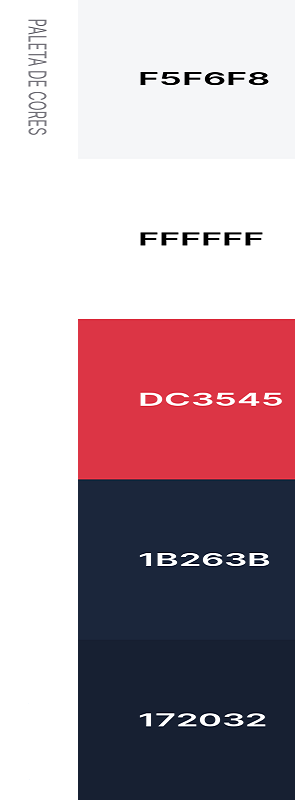

# Apresentação
Apresentação em vídeo do Projeto:

https://github.com/ICEI-PUC-Minas-PMV-ADS/pmv-ads-2023-2-e2-proj-int-t6-curriculofacil/blob/main/presentation/3.%20Apresenta%C3%A7%C3%A3o%20Final%20Entrega%20do%20Projeto/Apresenta%C3%A7%C3%A3o_Final_Projeto.mkv

## Título do Projeto

Currículo Fácil

[Acessar Site](https://curriculofacil.azurewebsites.net/)

## Identidade Visual (Marca, Design)

 

## Conjunto de Slides (Estrutura)

Apresentação final da solução desenvolvida
 
[Apresentação da solução - CurriculoFacil.pdf](https://github.com/ICEI-PUC-Minas-PMV-ADS/pmv-ads-2023-2-e2-proj-int-t6-curriculofacil/blob/main/presentation/3.%20Apresenta%C3%A7%C3%A3o%20Final%20Entrega%20do%20Projeto/Curr%C3%ADculo%20f%C3%A1cil%20Final.pdf)
